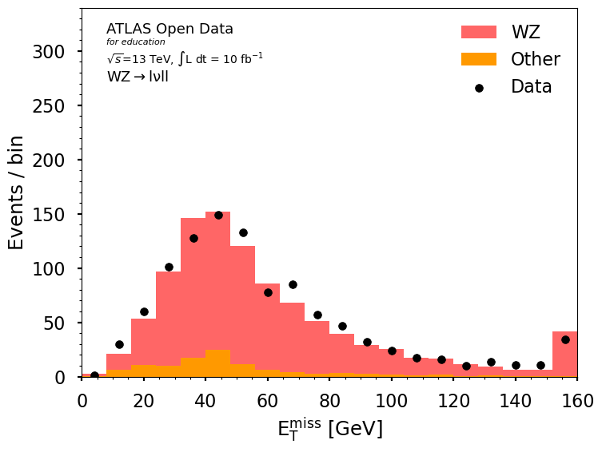
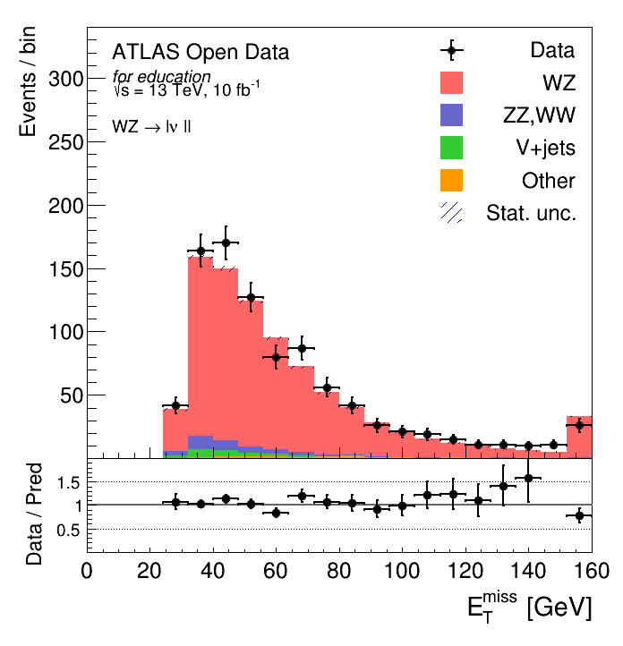

# WZ diboson production in a three-lepton final state
Exploration of Machine Learning methods to improve classical searches in Particle Physics.

## Dataset
[ATLAS Open Data](https://opendata.atlas.cern/)  
3lep dataset from the [13 TeV Data for Education](https://opendata.atlas.cern/docs/documentation/overview_data/data_education_2020)

## Goal
Replace existing cuts in analysis by a Machine Learning model, in order to try to optimize the ratio of signals to backgrounds and the final number of signals.

The cuts from the analysis obtain a signal to background ratio of 7.69, which corresponds to a **precision of 0.885**, while retrieving about 827 signals, which corresponds to a **true positive percentage of 0.407**.  
We want to obtain a ML model which can yield a higher signal to background ratio while retrieving at least the same number of signals.

## Models tried

A Decision Tree was able to achieve a mean cross-validation true positive percentage of 0.388 and a precision of 0.902. So, better precision but worse true positives.

A Random Forest was able to achieve a mean cross-validation true positive percentage of 0.408 and a precision of 0.870. So, worse precision but slightly better true positives.

A Boosted Decision Tree was able to achieve a mean cross-validation true positive percentage of 0.483 and a precision of 0.864. So, worse precision but much better true positives.

## Evaluation on the test set

Adjusting the threshold of the Decision Tree, it was possible to obtain a better precision and recall than the original cuts in the test set, as shown in the Precision-Recall curve and Confusion Matrix below.

This confusion matrix shows a 8.35 ratio of signals to backgrounds, while finding 0.430 true positives, which is better than the original cuts.
Moreover, when we apply the model cut to the test Monte Carlo data and the real data, we get the following plot for $\mathrm{E}_\mathrm{T}^\mathrm{miss}$:

.

If we compare it to the original plot (below), we find that it captures a good amount of WZ signals with energy below 30 GeV, which would be completely thrown away by the original analysis.

## Conclusions
- The final cuts of the WZ analysis were replaced by a simple ML model.
- A Decision Tree was able to improve the results of the classical analysis in both the number of signals and ratio of signals to backgrounds.
- More advanced tree-based methods were explored, yielding results close to the original analysis.

## Further work
- More cuts could be relaxed, for instance, the ones related to object selection.
- The use of sample weighting for model fitting was abandoned because it produced unconstrained probabilities. However, fitting with the sample weights is useful. How can this be overcome?
- Use an optimizer, e.g. Optuna, for hyperparameter tuning, instead of relying on grid and random searches.

### Final presentation slides
:link: [link](DAPP_Presentation.pdf)