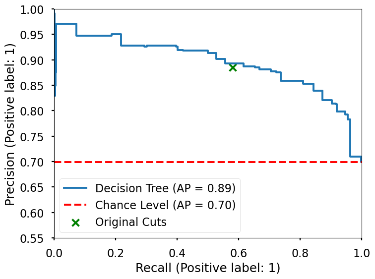
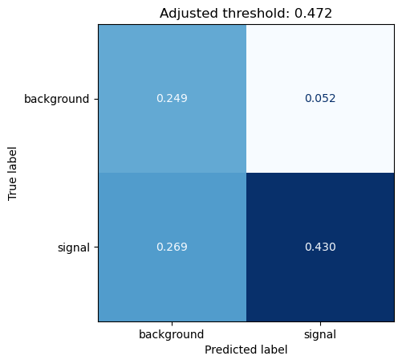

# WZ diboson production in a three-lepton final state
Exploration of Machine Learning methods to improve classical searches in Particle Physics.

# Dataset
[ATLAS Open Data](https://opendata.atlas.cern/)  
3lep dataset from the [13 TeV Data for Education](https://opendata.atlas.cern/docs/documentation/overview_data/data_education_2020)

# Goal
Replace existing cuts in analysis by a Machine Learning model, in order to try to optimize the ratio of signals to backgrounds and the final number of signals.

The cuts from the analysis obtain a signal to background ratio of 7.69, which corresponds to a **precision of 0.885**, while retrieving about 827 signals, which corresponds to a **true positive percentage of 0.407**.  
We want to obtain a ML model which can yield a higher signal to background ratio while retrieving at least the same number of signals.

# Models tried

A Decision Tree was able to achieve a mean cross-validation true positive percentage of 0.388 and a precision of 0.902. So, better precision but worse true positives.

A Random Forest was able to achieve a mean cross-validation true positive percentage of 0.408 and a precision of 0.870. So, worse precision but slightly better true positives.

A Boosted Decision Tree was able to achieve a mean cross-validation true positive percentage of 0.483 and a precision of 0.864. So, worse precision but much better true positives.

# Evaluation on the test set

Adjusting the threshold of the Decision Tree, it was possible to obtain a better precision and recall than the original cuts in the test set, as shown in the Precision-Recall curve and Confusion Matrix below.

